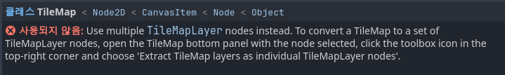

godot 공부하면서 생기는 끔찍한 일들에 대해 기록함

## TileMap 에 관하여

이놈 이거 아무래도 4버전 업데이트가 진행되며 사용이 권장되지 않는 모양

공부하던 영상은 사용해도 별 문제 없었는데 4.4 버전 기준으로 공부하던 나는 노드 오른쪽에 오류가 붙은 것을 보게 되어 버렸음

이젠 TileMapLayer이라는 친구를 대신 사용하라느 뜻으로 보임
그래도 자동 변환 기능은 만들어줬네

추후에는 아예 사라져 버릴지도 몰라