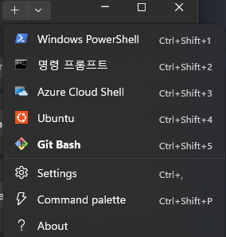

## bash shell 꾸미기
윈도우 cmd 너무 맘에 안들어서 git bash 를 기본으로 쓰고 있음

일단 윈 11기준이라 그 아래 버전도 되는진 모름

cmd 프로필을 건드릴건데 그게 아마 11에 생겼던 것 같아

## git bash 터미널 등록
기본적으로 터미널 프로필에 cmd, powershell 이런 기본제공 터미널들만 들어가있음

### 새 guid 생성
```powershell
[guid]::NewGuid()
```
이거 하면 뭐 뜨는데 그걸 가지고 가서

### 프로필에 등록



누르면 나오는 화면 맨 아래 왼쪽에 open JSON file 누르기

그 안에 profiles->list 항목안에 
```json
{
    "commandline": "깃 설치폴더\\bin\\bash.exe -i -l",
    "guid": "아까생성한 그거 복붙",
    "hidden": false,
    // "icon": "깃 설치폴더\\mingw64\\share\\git\\git-for-windows.ico", 
    // 필수는 아님 그냥 프로필에 git bash 아이콘 생김
    "name": "Git Bash",
    //"startingDirectory": "" 
    //이거하면 bash 시작 디렉토리 지정할 수 있음
}
```

대충 눈치껏 집어넣어

그리고 아까 그 설정창 보면 기본 프로필 지정할 수 있는데 난 이것도 그냥 git bash 로 해버렸음

## 화면 예쁘게 하기

### zsh 설치
https://packages.msys2.org/packages/zsh?variant=x86_64

이거 압축 두번 푼 다음 git 설치폴더에 그냥 때려박으면 됨

그리고 터미널 켜서 zsh 입력하면 뭐 무진장 뜸

그냥 0 누르면 .zshrc 파일 생성되었던 거 같은데 하나하나 읽어봐도 상관 없음

### zsh 설정

```bash
$ sh -c "$(curl -fsSL https://raw.githubusercontent.com/robbyrussell/oh-my-zsh/master/tools/install.sh)"

$ vi ~/.zshrc
ZSH_THEME="원하는 테마 이름" 
cd ~/.oh-my-zsh/plugins
git clone https://github.com/zsh-users/zsh-syntax-highlighting.git
echo "source ${(q-)PWD}/zsh-syntax-highlighting/zsh-syntax-highlighting.zsh" >> ${ZDOTDIR:-$HOME}/.zshrc
git clone https://github.com/zsh-users/zsh-autosuggestions.git
echo "source ${(q-)PWD}/zsh-autosuggestions/zsh-autosuggestions.zsh" >> ${ZDOTDIR:-$HOME}/.zshrc

# Add wisely, as too many plugins slow down shell startup.
plugins=(
        git
        zsh-autosuggestions
        zsh-syntax-highlighting
        ) # 여러개 고를 수 있는데 콜론 없이 나열함

source $ZSH/oh-my-zsh.sh
```


## 참고
### 테마 쇼핑
https://github.com/ohmyzsh/ohmyzsh/wiki/Themes

위에 있는 친구들 이름들은 기본적으로 추가적인 설치 없이 zshrc 설정만 건드리면 됨


테마 이것저것 써보고 있는데 powerlevel10k 이거 제일 예쁜듯
```bash
git clone --depth=1 https://github.com/romkatv/powerlevel10k.git ~/powerlevel10k
echo 'source ~/powerlevel10k/powerlevel10k.zsh-theme' >>~/.zshrc
```
그리고 .zshrc 안의 theme은 공란으로 남겨두기
이것저것 나오는데 직관적이니까 구경하면서 고르기
 

### 플러그인 쇼핑
https://github.com/ohmyzsh/ohmyzsh/wiki/Plugins

이것도 그럼. 그 외에는 그냥 깃허브 보고 찾기

너무 많으면 쉘 부팅 속도가 느려진대

### zshrc에 대해

alias 명령어를 bashrc에 등록해 쓰고 있었는데 이게 zsh 사용 이후로 적용이 안되기 시작함

알고보니 zsh를 쓰면 기본적으로 zshrc를 읽어오게 됨

그러니까 그냥 zshrc 파일에다가 [alias](docs\utils\github\alias.md) 나열하면 다 적용됨

alias 뿐 아니라 그냥 bashrc에 적어둔거 싹 다 옮겨도 ㄱㅊ
